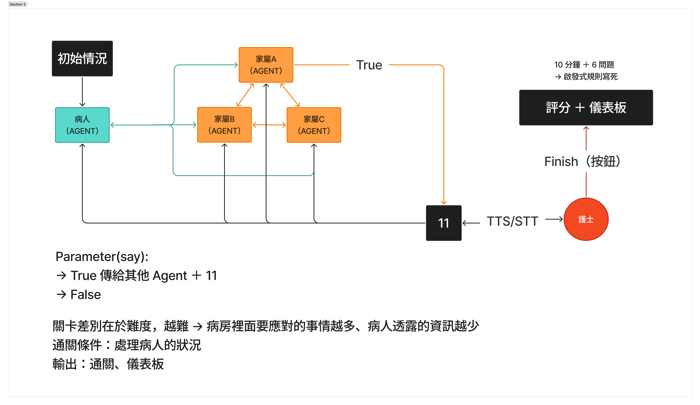

# Nurvo

護理溝通情境遊戲 MVP。透過語音互動與 AI 扮演的病患、家屬進行對話，訓練護理人員的溝通技巧。



## 系統架構
* **前端 (Frontend):** Vue.js 3, Vite, TypeScript
* **後端 (Backend):** FastAPI (Python)
* **語音服務 (TTS):** ElevenLabs API
* **人工智慧 (AI):** OpenAI GPT-4o / Gemini (HuggingFace)
* **資料庫 (Database):** Supabase (規劃中)

## 快速啟動 (Docker)

本專案已支援 Docker 容器化部署。請確認您的環境已安裝 Docker 與 Docker Compose。

1. 在 `nurvobackend` 資料夾中建立 `.env` 檔案，並填寫必要的 API 金鑰（可參考 `.env.example`）：
   ```env
   OPENAI_API_KEY=your_openai_api_key
   ELEVENLABS_API_KEY=your_elevenlabs_api_key
   ELEVENLABS_PATIENT_VOICE_ID=...
   ELEVENLABS_FAMILY_VOICE_ID=...
   ```

   可選的主動發話設定（預設即可運作）：
   ```env
   PROACTIVE_ENABLED=true             # 一鍵開關 NPC 主動發話
   PROACTIVE_IDLE_THRESHOLDS=25,20,15 # 遞進閒置門檻（秒），超出長度後維持最後一個
   PROACTIVE_COOLDOWN_SECONDS=10      # 兩次主動發話最小間隔
   PROACTIVE_ENDGAME_GUARD_SECONDS=30 # 剩餘時間少於此值時不觸發
   RECONNECT_GRACE_SECONDS=10         # 重連後緩衝秒數
   ```

2. 於專案根目錄執行以下指令啟動所有服務：
   ```bash
   docker compose -f infra/docker-compose.yml build --no-cache && docker compose -f infra/docker-compose.yml up --force-recreate
   ```

3. 服務啟動後：
   * 前端網頁：打開瀏覽器前往 [http://localhost:8080](http://localhost:8080)
   * 後端 API：[http://localhost:8000/docs](http://localhost:8000/docs) (Swagger UI)

如果需要停止服務，請執行：
```bash
docker compose -f ./infra/docker-compose.yml down
```

## 本地開發啟動 (無 Docker)

### 前端 (Vite)
```bash
cd nurvofronted
npm install
npm run dev
```

### 後端 (FastAPI)
```bash
cd nurvobackend
pip install -r requirements.txt
uvicorn main:app --reload
```

## UI 參考
[Canva Link](https://www.canva.com/design/DAHEF8M_KoU/_A96ERatW-9VF8yBo8md1Q/edit?utm_content=DAHEF8M_KoU&utm_campaign=designshare&utm_medium=link2&utm_source=sharebutton)
