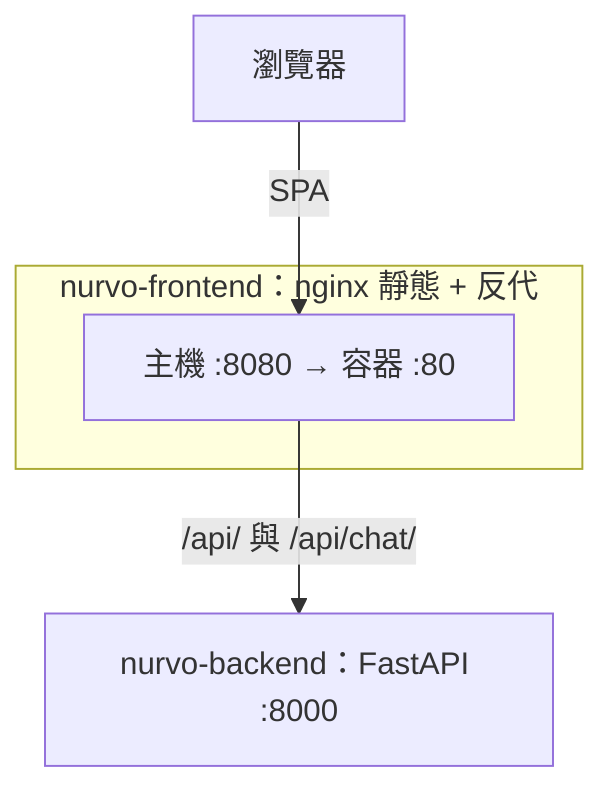

# Nurvo

護理溝通情境遊戲 MVP。透過語音互動與 AI 扮演的病患、家屬進行對話，訓練護理人員的溝通技巧。

## 系統架構

主流程：**瀏覽器 → 前端 nginx → FastAPI**。前端 nginx 直接將 `/api/*`（REST）與 `/api/chat/{session_id}`（WebSocket）反向代理到後端 FastAPI。


```mermaid
flowchart TB
  U["瀏覽器"]

  subgraph fe["nurvo-frontend：nginx 靜態 + 反代"]
    FE["主機 :8080 → 容器 :80"]
  end

  API["nurvo-backend：FastAPI :8000"]

  U -->|SPA| FE
  FE -->|/api/ 與 /api/chat/| API
```

* **前端 (Frontend):** Vue.js 3, Vite, TypeScript
* **後端 (Backend):** FastAPI (Python)
* **語音 (Voice):** ElevenLabs TTS、ElevenLabs Scribe（語音轉文字）
* **人工智慧 (AI):** OpenAI GPT-4o（情境與評分）、gpt-4.1-mini（對話預設，可調整）、DALL·E 3（病房背景圖，非同步產生）
* **資料庫 (Database):** Supabase（規劃中）

## 快速啟動 (Docker)

本專案已支援 Docker 容器化部署。請確認您的環境已安裝 Docker 與 Docker Compose。

1. 在 `nurvobackend` 資料夾中建立 `.env` 檔案，並填寫必要的 API 金鑰（可參考 `.env.example`）：
   ```env
   OPENAI_API_KEY=your_openai_api_key
   OPENAI_CONVERSATION_MODEL=gpt-4.1-mini
   ELEVENLABS_API_KEY=your_elevenlabs_api_key
   ELEVENLABS_TTS_MODEL=eleven_flash_v2_5
   ELEVENLABS_PATIENT_VOICE_ID=...
   ELEVENLABS_FAMILY_VOICE_ID=...
   # 可選：依角色與性別指定不同聲線；family_0/1/2 分別對應三位家屬
   ELEVENLABS_PATIENT_MALE_VOICE_ID=...
   ELEVENLABS_PATIENT_FEMALE_VOICE_ID=...
   ELEVENLABS_FAMILY_0_MALE_VOICE_ID=...
   ELEVENLABS_FAMILY_0_FEMALE_VOICE_ID=...
   ELEVENLABS_FAMILY_1_MALE_VOICE_ID=...
   ELEVENLABS_FAMILY_1_FEMALE_VOICE_ID=...
   ELEVENLABS_FAMILY_2_MALE_VOICE_ID=...
   ELEVENLABS_FAMILY_2_FEMALE_VOICE_ID=...
   ```

   可選的主動發話設定（預設即可運作）：
   ```env
   PROACTIVE_ENABLED=true
   PROACTIVE_IDLE_THRESHOLDS=25,20,15
   PROACTIVE_COOLDOWN_SECONDS=10
   PROACTIVE_ENDGAME_GUARD_SECONDS=30
   RECONNECT_GRACE_SECONDS=10
   ```
2. 於專案根目錄執行以下指令啟動所有服務：
   ```bash
   docker compose -f infra/docker-compose.yml build --no-cache && docker compose -f infra/docker-compose.yml up --force-recreate
   ```

3. 服務啟動後：
   * 前端網頁：[http://localhost:8080](http://localhost:8080)
   * 後端 API（容器內部，由前端 nginx 反代 `/api/*`）：`http://backend:8000`

   > 生產用前端 **nginx** 已將 `/api/`（REST）與 `/api/chat/`（WebSocket）直接轉到後端 FastAPI；後端 `8000` 埠主要供容器內部 upstream 使用。

如果需要停止服務，請執行：
```bash
docker compose -f ./infra/docker-compose.yml down
```

## 遊戲與 API 行為（摘要）

* **情境難度**：`POST /api/scenario/generate` 可帶 `{"difficulty":"easy"|"medium"|"hard"}`；伺服器依難度覆寫每局秒數（例如 easy 600／medium 480／hard 360，實際以後端 `TIME_LIMIT_BY_DIFFICULTY` 為準）。
* **背景圖**：DALL·E 在產生情境後**背景非同步**產圖；前端以 `GET /api/scenario/{session_id}/background` 輪詢，就緒後再顯示 URL。
* **即時聊天 WebSocket**：連上 `ws://<主機>/api/chat/{session_id}`（session_id 帶在路徑上，連線後即開始對話），之後於同一連線傳 `nurse_message`、`activity` 等訊息。

## 本地開發啟動 (無 Docker)

> **注意**：Vite 已設定 `/api`（含 WebSocket）→ `http://localhost:8000`，因此本機只要啟動後端 FastAPI（見下方）即可。

### 後端 (FastAPI)
```bash
cd nurvobackend
pip install -r requirements.txt
uvicorn main:app --reload
```

### 前端 (Vite)
```bash
cd nurvofronted
npm install
npm run dev
```

## UI 參考
[Canva Link](https://www.canva.com/design/DAHEF8M_KoU/_A96ERatW-9VF8yBo8md1Q/edit?utm_content=DAHEF8M_KoU&utm_campaign=designshare&utm_medium=link2&utm_source=sharebutton)
