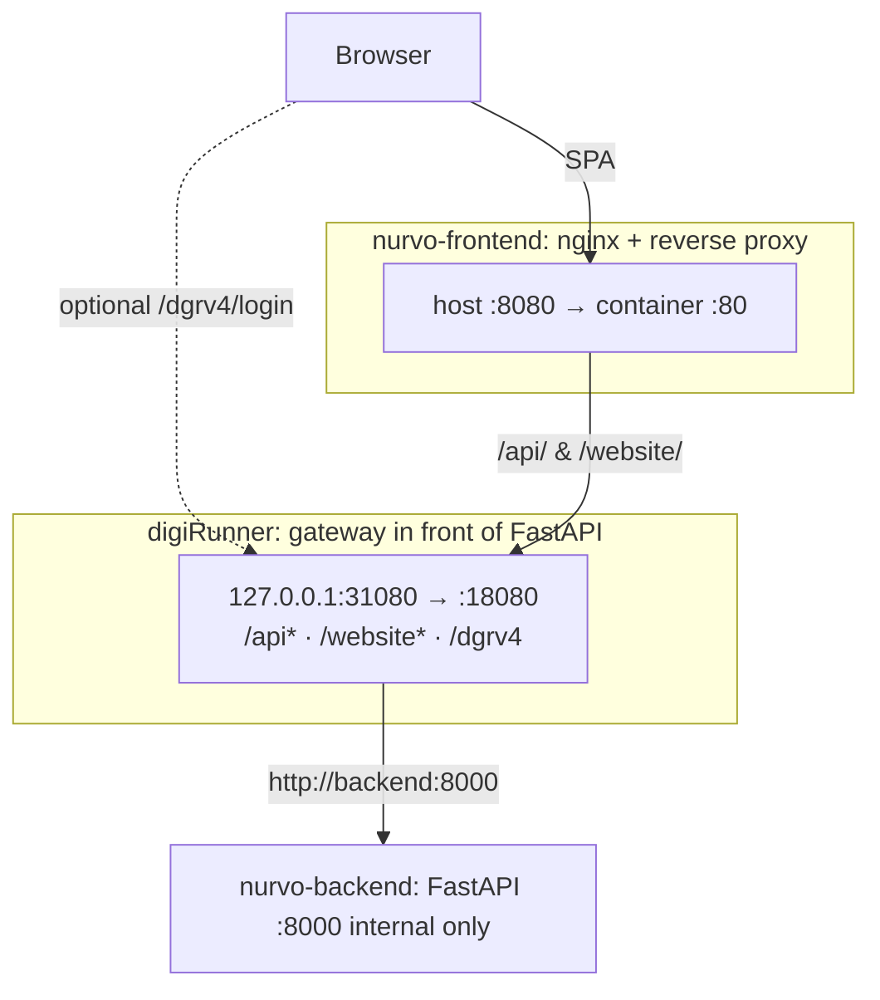

# Nurvo Project Specification

## 1. Project Overview
**Nurvo** is an AI-powered educational training web game platform. It simulates nurse-patient communication scenarios, utilizing AI visuals, AI voice, and LLMs to allow nurses to practice in randomized, AI-generated simulation scenarios.

## 2. Technology Stack

### Frontend
- **Framework**: [Vue.js 3](https://vuejs.org/) (Composition API)
- **Build Tool**: [Vite](https://vitejs.dev/)
- **Routing**: [Vue Router](https://router.vuejs.org/)
- **Testing**: [Vitest](https://vitest.dev/)

### Backend
- **Framework**: [FastAPI](https://fastapi.tiangolo.com/) (Python)
- **Runtime**: Python 3.x

### Infrastructure & Services
- **Database & Authentication**: [Supabase](https://supabase.com/) (planned for product auth / persistence; not required for the current in-memory game loop).
- **Voice Synthesis (TTS)**: [Eleven Labs](https://elevenlabs.io/)
- **Speech-to-Text (STT)**: Eleven Labs Scribe API (`/api/stt`); user-facing error messages are generic; detailed errors are logged server-side only.
- **LLM / AI Model**: [OpenAI GPT-4o](https://platform.openai.com/) for scenario JSON and NPC dialogue; **DALL·E 3** for optional ward background images (async; clients poll for readiness).
- **API Gateway**: [digiRunner Open Source](https://github.com/TPIsoftwareOSPO/digiRunner-Open-Source) — Java/Spring Boot gateway in front of all `/api/*` REST and WebSocket traffic. Exposed on the host as `127.0.0.1:31080` → container `18080` (avoids binding on all interfaces). Admin Console: `/dgrv4/login`. Uses file-backed H2 for proxy/site configuration persistence; optional `DIGIRUNNER_DB_PASSWORD` in a root or sibling `.env` for the Datasource password. Health-checked before the frontend container starts in Compose.

## 3. Architecture

digiRunner is wired **in front of** FastAPI: nginx forwards `/api/*` and `/website/*` to the gateway; the gateway proxies to `http://backend:8000`. Browsers can also open the digiRunner Admin UI directly on `:31080`.

### Client-Server Model
- **Frontend (`nurvofronted/`)**: Vue 3 + Vite. In **production Docker**, nginx serves static files and reverse-proxies `/api/*` and `/website/*` to digiRunner (so both REST and WebSocket upgrade requests hit the gateway). A separate optional `location` can proxy `/api/chat/` directly to FastAPI for debugging WebSocket without the digiRunner site.
- **API Gateway (`nurvo-digirunner`)**: Terminates all external `/api/*` REST and the **WebSocket Proxy** for chat. REST upstream: `http://backend:8000`. WebSocket proxy **site name** (e.g. `nurvo-chat`, configurable via `VITE_DIGIRUNNER_WS_SITE`) must match the digiRunner console; target URI: `ws://backend:8000/api/chat/ws`.
- **Backend (`nurvobackend/`)**: FastAPI under prefix `/api`. Orchestrates OpenAI, ElevenLabs TTS/STT, and in-memory `session_store` for MVP. **Not** intended to be reached from the public internet on port 8000 in the Compose profile; 8000 is published mainly for local debugging.

### HTTP / WebSocket API (current behavior)

- **Scenarios**  
  - `POST /api/scenario/generate` with body `{ "difficulty": "easy" | "medium" | "hard" }` (default `medium`).  
  - LLM returns a structured pain-assessment scenario; the server **overrides** `time_limit_seconds` from server-side per-difficulty map (`TIME_LIMIT_BY_DIFFICULTY`).  
  - Background image generation runs **asynchronously** after session creation; `GET /api/scenario/{session_id}/background` returns `{ "status": "pending" | "ready", "url": ... }` until the DALL·E task completes.
- **Chat (WebSocket)**  
  - **Gateway path (recommended)**: `GET ws://<host>/website/{siteName}` (via nginx → digiRunner). After connect, the **first** message must be JSON `{"type":"session_join","session_id":"<uuid>"}`. The server then runs the same session loop as below.  
  - **Direct FastAPI (optional)**: `GET ws://<host>/api/chat/{session_id}` — `session_id` in path; no `session_join` frame.  
  - **Fixed internal path** for the gateway upstream: `/api/chat/ws` (same game loop; expects `session_join` as the first message).  
  - Errors use `{ "type": "error", "message": "...", "retryable": false }` (and related timer / NPC message types as implemented).
- **Nursing record**  
  - `POST /api/record/submit` with non-empty `content`; rejects duplicate or invalid session state (e.g. not started, already completed).
- **STT**  
  - Upload endpoint returns a fixed user-facing string on failure; logs retain HTTP details.

## 4. Key Features

**Implemented in MVP (current tree)**  
1. Procedurally generated **pain assessment** nursing scenarios (Traditional Chinese) with three family members and communication challenges.  
2. Per-game **difficulty** (easy / medium / hard) affecting prompt guidance and enforced **time limit** (seconds) on the server.  
3. **Voice**: ElevenLabs TTS for patient/family lines; Scribe for nurse speech input.  
4. **LLM-driven** NPC replies and family interjections; optional **DALL·E** background with client polling.  
5. **WebSocket** chat with timer updates; compatibility with **digiRunner** WebSocket proxy (`session_join` handshake).  
6. **Nursing record** submission and scoring flow (per existing routers / stores).

**Planned**  
- **User Authentication**: Supabase (or equivalent) for accounts and long-term data.

## 5. Development Workflow
1. **With Docker (recommended for full stack)**  
   - From repo root: `docker compose -f infra/docker-compose.yml up` (build as needed).  
   - Configure digiRunner once: REST prefix `/api` → `http://backend:8000`; WebSocket site → `ws://backend:8000/api/chat/ws` (site name aligned with `VITE_DIGIRUNNER_WS_SITE`).
2. **Frontend (local Vite)**  
   - `npm install` in `nurvofronted/`, `npm run dev`.  
   - `vite.config.ts` proxies `/api` and `/website` to `http://localhost:31080` so the dev server matches production routing through digiRunner. Running digiRunner + backend (e.g. via Compose) is expected unless proxies are temporarily pointed at `localhost:8000`.
3. **Backend (local)**  
   - `pip install -r requirements.txt` in `nurvobackend/`, `uvicorn main:app --reload` (CORS already allows 5173 and 8080).

## 6. External Resources
- **UI Design**: [Canva Link](https://www.canva.com/design/DAHEF8M_KoU/_A96ERatW-9VF8yBo8md1Q/edit?utm_content=DAHEF8M_KoU&utm_campaign=designshare&utm_medium=link2&utm_source=sharebutton)
