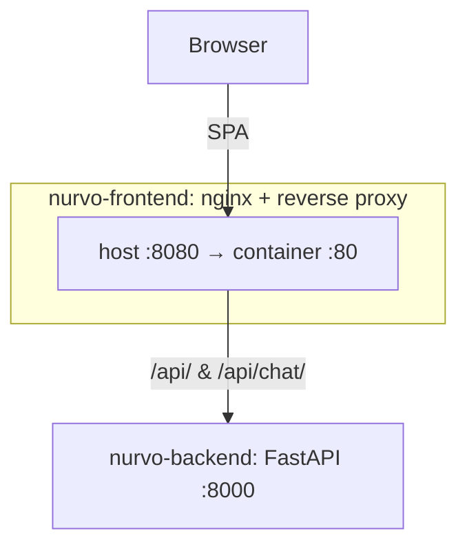

# Nurvo Project Specification

## 1. Project Overview
**Nurvo** is an AI-powered educational training web game platform. It simulates nurse-patient communication scenarios, utilizing AI visuals, AI voice, and LLMs to allow nurses to practice in randomized, AI-generated simulation scenarios.

## 2. Technology Stack

### Frontend
- **Framework**: [Vue.js 3](https://vuejs.org/) (Composition API)
- **Build Tool**: [Vite](https://vitejs.dev/)
- **Routing**: [Vue Router](https://router.vuejs.org/)
- **Testing**: [Vitest](https://vitest.dev/)

### Backend
- **Framework**: [FastAPI](https://fastapi.tiangolo.com/) (Python)
- **Runtime**: Python 3.x

### Infrastructure & Services
- **Database & Authentication**: **PostgreSQL** (`asyncpg`) for user accounts and completed-session persistence; auth is custom JWT (Google OAuth + email/password), **not** Supabase. Live game state stays in-memory; only *completed* sessions are written to the DB.
- **Voice Synthesis (TTS)**: [Eleven Labs](https://elevenlabs.io/)
- **Speech-to-Text (STT)**: Eleven Labs Scribe API (`/api/stt`); user-facing error messages are generic; detailed errors are logged server-side only.
- **LLM / AI Model**: [OpenAI GPT-4o](https://platform.openai.com/) for scenario JSON and NPC dialogue; **DALL·E 3** for optional ward background images (async; clients poll for readiness).
## 3. Architecture

The frontend nginx reverse-proxies `/api/*` (REST) and `/api/chat/{session_id}` (WebSocket) directly to FastAPI at `http://backend:8000`.

```mermaid
flowchart TB
  U["Browser"]

  subgraph fe["nurvo-frontend: nginx + reverse proxy"]
    FE["host :8080 → container :80"]
  end

  API["nurvo-backend: FastAPI :8000"]

  U -->|SPA| FE
  FE -->|/api/ & /api/chat/| API
```

### Client-Server Model
- **Frontend (`nurvofronted/`)**: Vue 3 + Vite. In **production Docker**, nginx serves static files and reverse-proxies `/api/*` (REST) and `/api/chat/` (WebSocket upgrade) directly to FastAPI at `http://backend:8000`.
- **Backend (`nurvobackend/`)**: FastAPI under prefix `/api`. Orchestrates OpenAI, ElevenLabs TTS/STT, and in-memory `session_store` for MVP. Port 8000 is published mainly for local debugging; in Compose it is normally reached via the frontend nginx.

### HTTP / WebSocket API (current behavior)

- **Scenarios**  
  - `POST /api/scenario/generate` with body `{ "difficulty": "easy" | "medium" | "hard" }` (default `medium`).  
  - LLM returns a structured pain-assessment scenario; the server **overrides** `time_limit_seconds` from server-side per-difficulty map (`TIME_LIMIT_BY_DIFFICULTY`).  
  - Background image generation runs **asynchronously** after session creation; `GET /api/scenario/{session_id}/background` returns `{ "status": "pending" | "ready", "url": ... }` until the DALL·E task completes.
- **Chat (WebSocket)**  
  - `GET ws://<host>/api/chat/{session_id}` — `session_id` is carried in the path; the session loop starts on connect (no handshake frame).  
  - After connecting, the client sends `nurse_message` / `activity` frames on the same connection.  
  - Errors use `{ "type": "error", "message": "...", "retryable": false }` (and related timer / NPC message types as implemented).
- **Nursing record**  
  - `POST /api/record/submit` with non-empty `content`; rejects duplicate or invalid session state (e.g. not started, already completed).
- **STT**  
  - Upload endpoint returns a fixed user-facing string on failure; logs retain HTTP details.

## 4. Key Features

**Implemented in MVP (current tree)**  
1. Procedurally generated **pain assessment** nursing scenarios (Traditional Chinese) with three family members and communication challenges.  
2. Per-game **difficulty** (easy / medium / hard) affecting prompt guidance and enforced **time limit** (seconds) on the server.  
3. **Voice**: ElevenLabs TTS for patient/family lines; Scribe for nurse speech input.  
4. **LLM-driven** NPC replies and family interjections; optional **DALL·E** background with client polling.  
5. **WebSocket** chat with timer updates over the path-based `/api/chat/{session_id}` endpoint.  
6. **Nursing record** submission and scoring flow (per existing routers / stores).

**Planned**  
- **Self-service sign-up** and linking persisted sessions to the logged-in user
  (`game_sessions.user_id` is currently written as `NULL`). Auth itself (Google OAuth +
  email/password JWT on Postgres) is already built.

## 5. Development Workflow
1. **With Docker (recommended for full stack)**  
   - From repo root: `docker compose -f infra/docker-compose.yml up` (build as needed). Only `backend` + `frontend` run; the frontend nginx proxies `/api/*` and `/api/chat/` to the backend.
2. **Frontend (local Vite)**  
   - `npm install` in `nurvofronted/`, `npm run dev`.  
   - `vite.config.ts` proxies `/api` (REST + WebSocket) to `http://localhost:8000`, so just run the backend alongside it.
3. **Backend (local)**  
   - `pip install -r requirements.txt` in `nurvobackend/`, `uvicorn main:app --reload` (CORS already allows 5173 and 8080).

## 6. External Resources
- **UI Design**: [Canva Link](https://www.canva.com/design/DAHEF8M_KoU/_A96ERatW-9VF8yBo8md1Q/edit?utm_content=DAHEF8M_KoU&utm_campaign=designshare&utm_medium=link2&utm_source=sharebutton)
